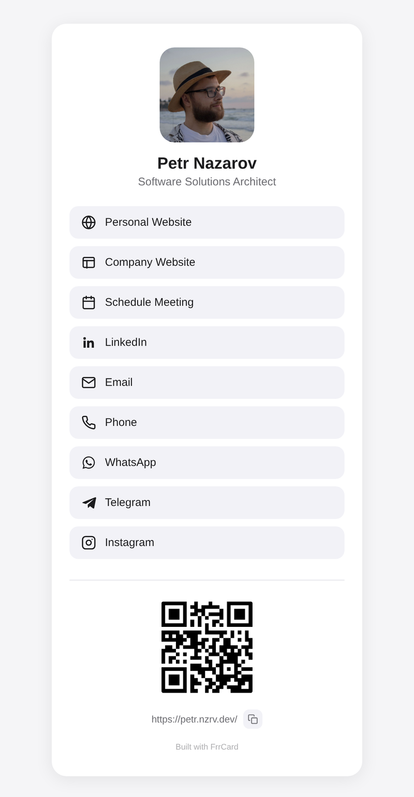
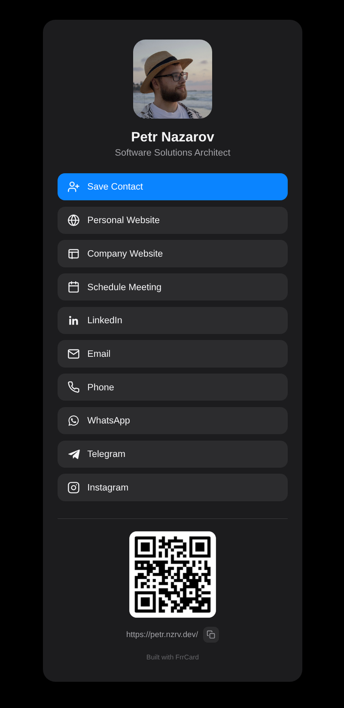

# FrrCard

**A self-hosted digital business card.** One JSON file per person in, one static
page out — photo, tap-to-act contact links, a downloadable contact file, and a
QR code that points back at the card's own URL.

No database, no tracking, no third-party service holding your contact details
hostage. It runs as a single container: drop your JSON in `data/`, `docker
compose up`, and the card is live. The renderer underneath is a few hundred
lines of plain Node with a single runtime dependency (a QR generator), and what
it produces is a folder of `index.html`, `contact.vcf` and `qr.svg` files you can also serve from any
static host.

Built by [frrcode.com](https://frrcode.com). Free to use, fork, and self-host —
just not to resell ([license](#license)).

**Live demo → [jane.frrcode.com](https://jane.frrcode.com)** — the bundled example
card, built by this repo and running in production.

<p align="center">
  
  &nbsp;&nbsp;
  
</p>

<p align="center"><sub>The same card, light and dark — the theme follows the visitor's system setting.</sub></p>

---

## Why

Digital business card services want a monthly subscription for what is, in
substance, a single HTML page. FrrCard is that page:

- **Yours.** Your domain, your server, your contact data. It never leaves your box.
- **Fast.** One self-contained HTML file per card. No JS framework, no web fonts,
  no network calls — the QR code is an SVG generated alongside the page.
- **Multi-person.** Drop in a second JSON file and you have a second card — one
  container can serve a whole family or team.
- **Native-feeling.** System font stack, automatic light/dark mode, `mailto:` /
  `tel:` / `wa.me` links that open the right app on a phone.
- **Shareable in person.** A built-in QR code and a one-tap copy-link button.
- **Saveable.** A **Save Contact** button hands over a `.vcf` — photo and all —
  that drops straight into iOS Contacts, Android, Outlook or anything else that
  reads vCard.

## Quick start

You need Docker with the Compose plugin. Nothing else — no Node, no checkout.

```bash
mkdir frrcard && cd frrcard
mkdir -p data public
curl -O https://raw.githubusercontent.com/FrrCode/FrrCard/main/compose.yaml
docker compose up -d
```

Open **http://localhost:8080**. With `data/` still empty the container renders
the bundled example card and redirects `/` to it, so the first run shows a
working card rather than a 404. The log says as much:

```
no data/*.json found — building the bundled example card
put your own <name>.json in data/ and restart to replace dist/example/
```

That `compose.yaml` is the whole configuration — image, port, and the two
folders it reads:

```yaml
services:
  frrcard:
    image: ghcr.io/frrcode/frrcard:latest
    # Swap the image line for this to build from a checkout instead:
    # build: .
    restart: unless-stopped
    ports:
      - "8080:8080"
    environment:
      # Serve a single card at / instead of every card at /<name>/:
      # CARD: jane
      PORT: 8080
    volumes:
      - ./data:/app/data:ro
      - ./public:/app/public:ro
```

The image (**`ghcr.io/frrcode/frrcard`**, amd64 and arm64) holds the renderer, a
small static server and that one demo card — nobody's real card data is baked
in. On start it renders whatever JSON it finds in the mounted `data/` and serves
the result.

### Your own card

Write one JSON file per person into `data/`. Start from the template:

```bash
curl -o data/jane.json https://raw.githubusercontent.com/FrrCode/FrrCard/main/data/example.json.sample
$EDITOR data/jane.json          # the fields are documented below
docker compose up -d --force-recreate
```

As soon as `data/` holds one `*.json`, only your cards are built. Each is served
under its own path: `data/jane.json` becomes **http://localhost:8080/jane/**,
with its contact file at `/jane/contact.vcf`.

For a photo, drop the image into `public/<name>/` — `public/jane/jane.jpg` is
reachable from the card as `"photoUrl": "./jane.jpg"`. A remote URL works too.

Cards render at container start, so **every edit to a data file needs a
restart**. The build takes milliseconds:

```bash
docker compose restart                  # re-render after an edit
docker compose up -d --force-recreate   # …and forget what the last run built
```

The difference matters once: a restarted container keeps the `dist/` it rendered
before, so the demo card — and any card whose JSON you later rename or delete —
stays reachable until the container is recreated. `--force-recreate` starts from
an empty `dist/`.

### Configuration

| Variable | Default | What it does |
|---|---|---|
| `PORT` | `8080` | Port inside the container |
| `HOST` | `0.0.0.0` | Interface to bind |
| `CARD` | — | Serve `dist/<CARD>` at `/` instead of every card under `/<name>/` |

To put a single card at the root rather than under its own path, uncomment the
`CARD` line:

```yaml
    environment:
      CARD: jane
      PORT: 8080
```

`PORT` is the port *inside* the container, so changing it means changing the
right-hand side of the `ports:` mapping too.

Day-to-day:

```bash
docker compose up -d        # render the cards and serve them
docker compose restart      # re-render after editing a data file
docker compose logs -f      # the build output lands here
docker compose down         # stop and remove the container
docker compose pull && docker compose up -d   # update to a newer image
```

A few things worth knowing:

- **`/` returns 404 when serving several cards.** There is no index listing who
  lives on the box — reach a card by its own path, or use `CARD`. The one
  exception is the first run described above, where `/` redirects to `/example/`.
- **`/healthz`** answers `ok`; the image's `HEALTHCHECK` uses it.
- **Nothing is written to the host.** `data/` and `public/` are mounted
  read-only and the rendered files stay inside the container. Add
  `- ./dist:/app/dist` to the volumes if you want them on your side.
- **The server sends `contact.vcf` as `text/vcard`**, which is what makes phones
  offer to save the contact instead of showing the file as text.
- **Only releases publish an image**, so `latest` always points at a released
  version — pushes to `main` never move it. Alongside it each release pushes the
  version (`1.1.2`), the minor line (`1.1`) and the commit SHA; pin one of those
  in `compose.yaml` to stay on a version you chose.

### A real domain

Put a reverse proxy in front for TLS. One subdomain per card off a single
container, with Caddy:

```caddyfile
jane.example.com {
    rewrite * /jane{uri}
    reverse_proxy localhost:8080
}
```

…or run one container per card with `CARD` set and skip the rewrite:

```nginx
server {
    server_name jane.example.com;
    location / { proxy_pass http://127.0.0.1:8080; }
}
```

Whichever you pick, the `domain` field in the data file should match the public
URL — it drives the canonical link and the QR code, and the container has no way
to know what's in front of it.

### Deploying from a checkout

Your card data lives on your machine, not in git, so something has to carry it to
the server. `just deploy` does that for a server running the image under compose:

```bash
just deploy                       # build locally as a check, sync data/ and public/,
                                  # pull the latest release, recreate the container
DEPLOY_HOST=my-server just deploy # override the ssh host (default: frrcode)
```

It expects a service named `frrcard` in the compose file in your ssh home, with
its mounts at `data/frrcard/data` and `data/frrcard/public`. `DEPLOY_COMPOSE_DIR`,
`DEPLOY_SERVICE` and `DEPLOY_CARD_DIR` move those. Both syncs use `--delete`, so
a data file removed locally disappears from the server too — and since the
container is recreated rather than restarted, so does its card.

## The data file

Each `data/<name>.json` produces the card at `/<name>/`. The file name is the
path and nothing else — pick whatever you like.

```json
{
  "name": "Jane Doe",
  "firstName": "Jane",
  "lastName": "Doe",
  "jobTitle": "Ceramicist & Studio Owner",
  "description": "Contact links, social profiles, and business card for Jane Doe.",
  "photoUrl": "./jane.jpg",
  "faviconUrl": "https://example.com/favicon.png",
  "domain": "jane.example.com",
  "links": [
    { "type": "website",  "value": "https://jane.example.com" },
    { "type": "schedule", "value": "https://cal.com/jane", "label": "Book a studio visit" },
    { "type": "email",    "value": "jane@example.com" },
    { "type": "whatsapp", "value": "+15551234567" }
  ]
}
```

| Field | Required | What it does |
|---|:---:|---|
| `name` | ✅ | Heading on the card, and the `og:site_name` |
| `firstName`, `lastName` | ✅ | `profile:first_name` / `profile:last_name` Open Graph tags |
| `jobTitle` | ✅ | Subtitle under the name, and part of the `<title>` |
| `description` | ✅ | Meta description and social-share blurb |
| `photoUrl` | ✅ | Profile image. Absolute URL, or a relative path into `public/<name>/` |
| `faviconUrl` | ✅ | Browser tab icon |
| `domain` | ✅ | Where the card will live. Drives the canonical URL and the QR target |
| `links` | ✅ | The buttons, rendered top to bottom in the order you list them |
| `qrTarget` | — | Override what the QR code encodes. Defaults to `https://<domain>/` |
| `credit` | — | `false` hides the "Built with FrrCard" footer link. Shown by default |
| `organization` | — | `ORG` in the contact file. Not shown on the card |
| `vcard` | — | `false` drops the Save Contact button and the `.vcf`. On by default |
| `vcardLabel` | — | Text on the Save Contact button. Defaults to `Save Contact` |

Every field marked required is used somewhere in the page, and the build does not
check for you — leave one out and the word `undefined` shows up in the rendered
card (or, for `links`, the build fails and the container logs say so). Fill them
all in.

### Link types

Every entry is `{ "type": ..., "value": ... }` with an optional `"label"` to
override the default text. Each type brings its own inline SVG icon and knows how
to turn a bare value into the right kind of href.

| `type` | Default label | `value` should be | Becomes |
|---|---|---|---|
| `website` | Personal Website | full URL | the URL |
| `company` | Company Website | full URL | the URL |
| `cv` | CV | full URL to a PDF or page | the URL |
| `schedule` | Schedule Meeting | full URL | the URL (Calendly, Cal.com, …) |
| `linkedin` | LinkedIn | full profile URL | the URL |
| `email` | Email | address | `mailto:` |
| `phone` | Phone | `+1 555 123 4567` | `tel:` with spaces and dashes stripped |
| `whatsapp` | WhatsApp | phone number | `https://wa.me/<digits>` |
| `telegram` | Telegram | `@handle`, `handle`, or full URL | `https://t.me/handle` |
| `instagram` | Instagram | `@handle`, `handle`, or full URL | `https://www.instagram.com/handle` |

An unrecognised `type` stops the build with `Unknown link type: "..."`. Adding
your own means editing `build.js`, which is a [development](#development) job:
an entry in the `ICONS` map at the top of the file — an SVG, a default label, an
`href` function, whether it opens in a new tab, and optionally a `vcard`
function returning the property it becomes in the contact file.

### Photos and other assets

Anything in `public/<name>/` is copied next to that card's generated
`index.html`. So `public/jane/jane.jpg` is reachable from `data/jane.json` as
`"photoUrl": "./jane.jpg"` — no CDN, no hotlinking. Create the folder yourself;
if it doesn't exist, the build simply skips the copy.

## The contact file

Alongside the page, each card gets a `contact.vcf` built from the same JSON, and
a **Save Contact** button at the top of the links that points at it. Tapping it
on a phone opens the OS "add contact" sheet with everything already filled in —
the fastest way to end up in someone's address book after a handshake.

It is vCard 3.0, the dialect iOS Contacts, Android and Outlook all read:

| From the data file | Becomes |
|---|---|
| `firstName`, `lastName`, `name` | `N` and `FN` |
| `jobTitle` | `TITLE` |
| `organization` | `ORG` |
| `email` links | `EMAIL;TYPE=INTERNET` |
| `phone` links | `TEL;TYPE=CELL,VOICE` |
| `website`, `company`, `cv`, `schedule` links | `URL` |
| `linkedin`, `whatsapp`, `telegram`, `instagram` links | `X-SOCIALPROFILE` |
| `photoUrl` | `PHOTO`, base64-embedded |
| `domain` | `SOURCE` |

Each property is written in a labelled group (`item1.URL` + `item1.X-ABLabel`), so
the label you gave a link on the card — `"Book a studio visit"` and all — is the
label that shows up in Contacts.

**The photo is inlined.** The build reads it from `public/<name>/` or fetches the
remote URL once and embeds the bytes, so the saved contact keeps its picture
offline. If the image can't be read, is over 512 KB, or isn't a JPEG/PNG/GIF/WebP,
the build prints a note and falls back to a plain URL reference (or, for a local
file it couldn't read, no photo at all) — it never fails the build over a photo.

The button deliberately carries no `download` attribute: on iOS and Android that
makes the browser hand the file to the Contacts app instead of parking it in
Downloads.

Set `"vcard": false` to skip the button and the file entirely.

### The credit link

Every card ends with a small, muted **Built with FrrCard** link to the FrrCard
project page. It's on by default — if FrrCard is useful to you, leaving it there
is how other people find it.

Turning it off is one line in the card's data file, no strings attached:

```json
{
  "name": "Jane Doe",
  "credit": false
}
```

Only the literal `false` hides it; any other value (or no `credit` key at all)
leaves the link in place.

## Notes

- **The QR code is generated at build time** into `dist/<name>/qr.svg`, so the
  card calls no outside service to show it. It encodes `qrTarget` if set, else
  `https://<domain>/`. To use your own, drop a `qr.svg` in `public/<name>/` — it
  is copied over the generated one.
- **A remote `photoUrl` is fetched at build time** so it can be embedded in the
  `.vcf`. It is the only network call the build makes, it has an 8-second timeout,
  and failing it only costs you the photo in the contact file.
- The build is not incremental: it re-renders every card on every start. At this
  size that takes milliseconds — plus one photo fetch per card with a remote photo.

---

# Development

Everything above needs only the published image. Clone the repo when you want to
change the renderer or the template, or to build the cards yourself and host the
output somewhere static.

```bash
git clone git@github.com:FrrCode/FrrCard.git frrcard
cd frrcard

cp data/example.json.sample data/jane.json
$EDITOR data/jane.json

pnpm install --prod              # the QR generator build.js needs
node build.js                    # built dist/jane/index.html (jane.example.com)
                                 # built dist/jane/contact.vcf (Jane Doe)
node serve.js dist/jane          # http://localhost:8080
```

Requirements: Node.js 18 or newer and pnpm (only for the build — the output is static),
optionally [`just`](https://github.com/casey/just) for the recipes and `rsync`
and `ssh` for deploying.

`serve.js` is the same server the image runs: `node serve.js` serves all of
`dist/` with cards at `/<name>/`, `CARD=jane` or a path argument serves one card
at `/`.

Build the image from the checkout with `docker compose build` after swapping
`image:` for `build: .`, or `docker build -t frrcard .`.

## What's in git, and what isn't

The repository tracks the machinery; your content stays on your machine.

```
build.js         ✅  the renderer
serve.js         ✅  the static server (local look, and the image)
changelog.js     ✅  the CHANGELOG.md generator
template.html    ✅  markup, CSS, copy-button script
example.json     ✅  the demo card the image falls back to
justfile         ✅  build, deploy, changelog + release recipes
Dockerfile       ✅  the image
compose.yaml     ✅  how to run it
.github/         ✅  the changelog and docker workflows
CHANGELOG.md     ✅  generated, committed
data/            ✅  folder tracked, contents ignored
public/<name>/   ✅  folder tracked, contents ignored
dist/            ❌  build output
```

Personal cards are never committed, so you can fork this publicly and push
freely without leaking a phone number. Keep your `data/` and `public/` files
backed up somewhere; git isn't doing it for you.

## Customizing the look

`template.html` is one file: markup, an embedded stylesheet, and a small copy-link
script. The build substitutes `{{PLACEHOLDER}}` tokens and changes nothing else,
so edit it like any static page.

Available tokens: `{{NAME}}`, `{{FIRST_NAME}}`, `{{LAST_NAME}}`, `{{JOB_TITLE}}`,
`{{DESCRIPTION}}`, `{{PHOTO_URL}}`, `{{FAVICON_URL}}`, `{{CANONICAL_URL}}`,
`{{OG_IMAGE}}`, `{{QR_IMAGE}}`, `{{QR_LABEL}}`, `{{VCARD}}`, `{{LINKS}}`,
`{{CREDIT}}`.

Colors live in the `:root` block at the top of the `<style>` tag, with a
`prefers-color-scheme: dark` override right below it. Referencing a token that
doesn't exist fails the build instead of rendering a literal `{{TYPO}}`.

## Serving the built files instead of the container

`dist/` is the whole artifact — GitHub Pages, Netlify, Cloudflare Pages, S3 and
every other static host take it as-is.

```bash
just build                        # node build.js
just deploy-static                       # build, then rsync dist/ to the server
DEPLOY_HOST=my-server just deploy-static # override the target host (default: frrcode)
```

`just deploy-static` runs `rsync -avz --delete dist/ <host>:deployments/card`. **`--delete`
is real** — it mirrors `dist/` onto the target directory and removes anything
else there, so give the cards their own directory. Point the recipe at wherever
your web root lives.

One subdomain per card, with Caddy:

```caddyfile
jane.example.com {
    root * /home/you/deployments/card/jane
    file_server
}
```

…or as paths on a single domain, with nginx:

```nginx
server {
    server_name example.com;
    root /home/you/deployments/card;
    location / { try_files $uri $uri/ $uri/index.html =404; }
}
```

One thing worth checking: your host should send `contact.vcf` as `text/vcard` (or
`text/x-vcard`). Most already do — the bundled `serve.js` does. If yours falls
back to `text/plain`, browsers render the file as text instead of offering to
save the contact, so pin it explicitly:

```caddyfile
# Caddy
header /contact.vcf Content-Type "text/vcard; charset=utf-8"
```

```nginx
# nginx
location = /contact.vcf { default_type text/vcard; }
```

## Releases and the changelog

[CHANGELOG.md](CHANGELOG.md) is generated, never hand-edited. `changelog.js` reads
the git history, parses each subject as a
[Conventional Commit](https://www.conventionalcommits.org/) (`type(scope)!: subject`),
and groups the entries under the tag they shipped in — anything past the newest tag
lands in **Unreleased**.

```bash
just changelog        # rewrite CHANGELOG.md
just changelog-check  # exit 1 if it is behind the history
just release          # cut a patch release (or: just release minor / major)
```

`just release` is the whole ceremony: it works out the next version from
`package.json` for the bump level you asked for, refuses anything but a clean
`main` and an unused semver tag, writes the version back, commits it as
`chore(release): v1.1.1`, tags it, and pushes the branch and the tag. CI takes it
from there:

- the image goes to GHCR under `1.1.1`, `1.1` and `latest`;
- everything that was under **Unreleased** moves into a `## [v1.1.1]` section
  with a compare link, committed back to `main` — so pull afterwards, since that
  commit lands on top of yours;
- the **GitHub release** is published with that section as its body, marked a
  prerelease when the version has a `-rc.1`-style suffix.

That last step matters because a pushed tag is *not* a release. GitHub lists the
tag on the releases page with an empty body until something creates one. The
notes come from `node changelog.js --notes v1.1.1`, which reads the history
rather than scraping the rendered markdown back out of `CHANGELOG.md`.

Release commits describe the release rather than the project, so `changelog.js`
leaves them out of the entries — while still letting the tag on one open its
section.

`.github/workflows/changelog.yml` does it for you: every push to `main` and every
`v*` tag regenerates the file and commits it back to `main` if it changed. Writing
`feat: …` / `fix: …` / `docs: …` commit messages is the whole of the maintenance
burden — an unparseable subject still shows up, under **Other**, and `!` or a
`BREAKING CHANGE:` footer promotes an entry to a **Breaking changes** block at the
top of its release.

`.github/workflows/docker.yml` publishes the image, and a `v*` tag is the only
thing that makes it publish: it builds, smoke-tests the result against the
example card, and pushes it to GHCR tagged `latest`, the version, the minor line
and the commit SHA. Pull requests touching the image files — and manual runs —
build and smoke-test without pushing anything, so a push to `main` leaves the
registry alone. If you fork this and push your own image, note that GHCR creates
the package **private** — flip it to Public once in the repo's package settings.

---

# License

[ISC with the Commons Clause](LICENSE).

**Free to use and modify.** Run it for yourself, for your family, or for everyone
at the company you work for. Fork it, redesign the template, change whatever you
like — no fee, no permission needed. If you pass it on, keep the license notice
with it, as ISC asks.

**Not free to sell.** You may not charge third parties for a product or service
whose value comes substantially from FrrCard — a hosted card SaaS, a paid fork,
or client work billed for running it on their behalf. That needs written
permission — get in touch through [frrcode.com](https://frrcode.com).

Because of the Commons Clause this is *source-available*, not OSI open source.
If that distinction matters to your organisation, read the [LICENSE](LICENSE) in
full — it's short.

---

Made by **[frrcode.com](https://frrcode.com)**
